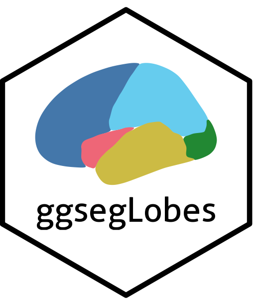
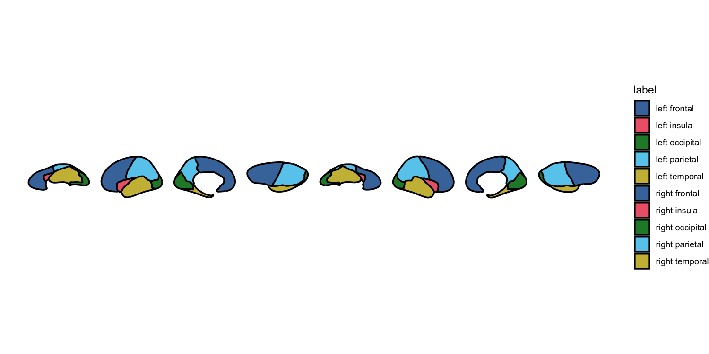

<!-- README.md is generated from README.Rmd. Please edit that file -->

# ggsegLobes 

<!-- badges: start -->

[](https://github.com/gbarisano/ggsegLobes/actions/workflows/R-CMD-check.yaml)
<!-- badges: end -->

Lobar cortical parcellation for the
[`ggseg`](https://github.com/ggsegverse/ggseg) ecosystem.

`ggsegLobes` provides a lobar parcellation (frontal, parietal, temporal,
occipital, and insula, per hemisphere) derived from the Desikan-Killiany
atlas (`ggseg::dk()`) by dissolving its cortical regions into lobes.

## Installation

``` r
# with pak (recommended)
# install.packages("pak")
pak::pak("gbarisano/ggsegLobes")

# or with remotes
# remotes::install_github("gbarisano/ggsegLobes")
```

## Usage

``` r
library(ggseg)
library(ggsegLobes)
library(ggplot2)

ggplot() +
  geom_brain(atlas = dklobes(), aes(fill = label), show.legend = TRUE,color = "black",linewidth = 0.8) +
  scale_fill_manual(values = dklobes()$palette, na.value = "grey") +
  theme_void()
```



Available regions:

``` r
ggseg.formats::atlas_regions(dklobes())
#> [1] "frontal"   "insula"    "occipital" "parietal"  "temporal"
```

## 3D

The atlas also renders in 3D with
[`ggseg3d`](https://github.com/ggsegverse/ggseg3d):

``` r
# install.packages("ggseg3d",
#   repos = c("https://ggsegverse.r-universe.dev", "https://cloud.r-project.org"))
library(ggseg3d)

ggseg3d(atlas = dklobes()) |>
  pan_camera("left lateral")
```

## Lobe composition

Derived from Desikan-Killiany cortical regions:

- **Frontal:** superior/middle/inferior frontal, precentral,
  orbitofrontal, frontal pole, paracentral, anterior + posterior
  cingulate
- **Parietal:** superior/inferior parietal, postcentral, precuneus,
  supramarginal, isthmus cingulate
- **Temporal:** superior/middle/inferior temporal, fusiform, entorhinal,
  parahippocampal, temporal pole, transverse temporal, banks of STS
- **Occipital:** lateral occipital, cuneus, lingual, pericalcarine
- **Insula**

## Reference

Desikan RS, et al. (2006). An automated labeling system for subdividing
the human cerebral cortex on MRI scans into gyral based regions of
interest. *NeuroImage*, 31(3):968-980.
<https://doi.org/10.1016/j.neuroimage.2006.01.021>
